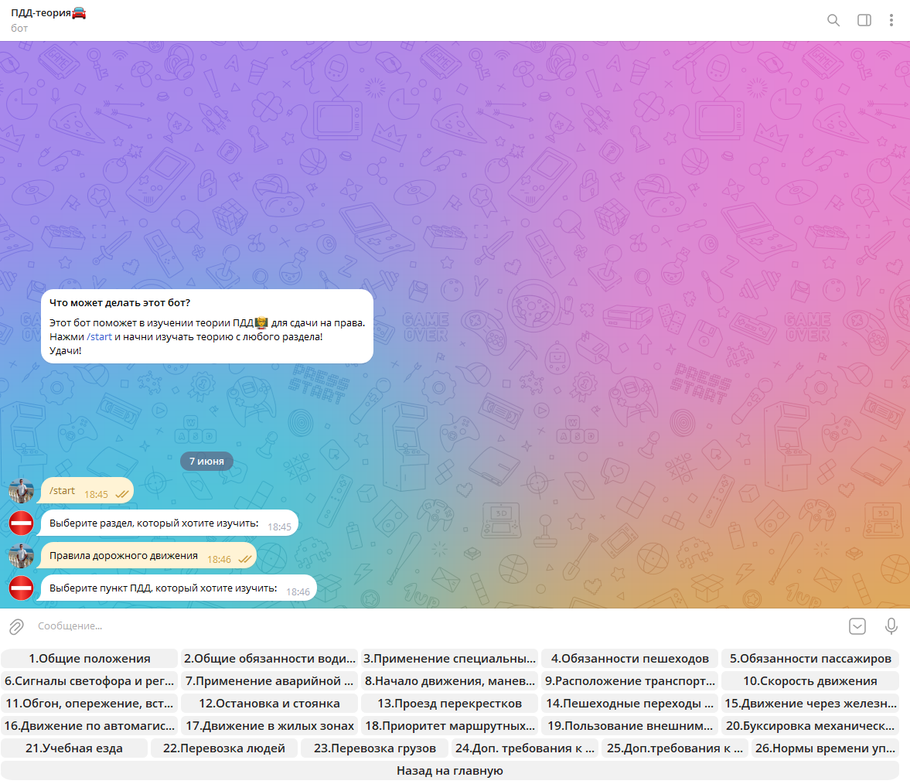
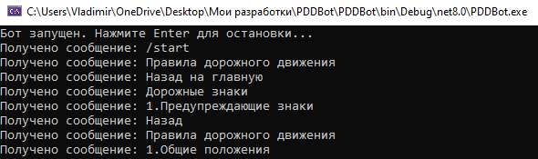
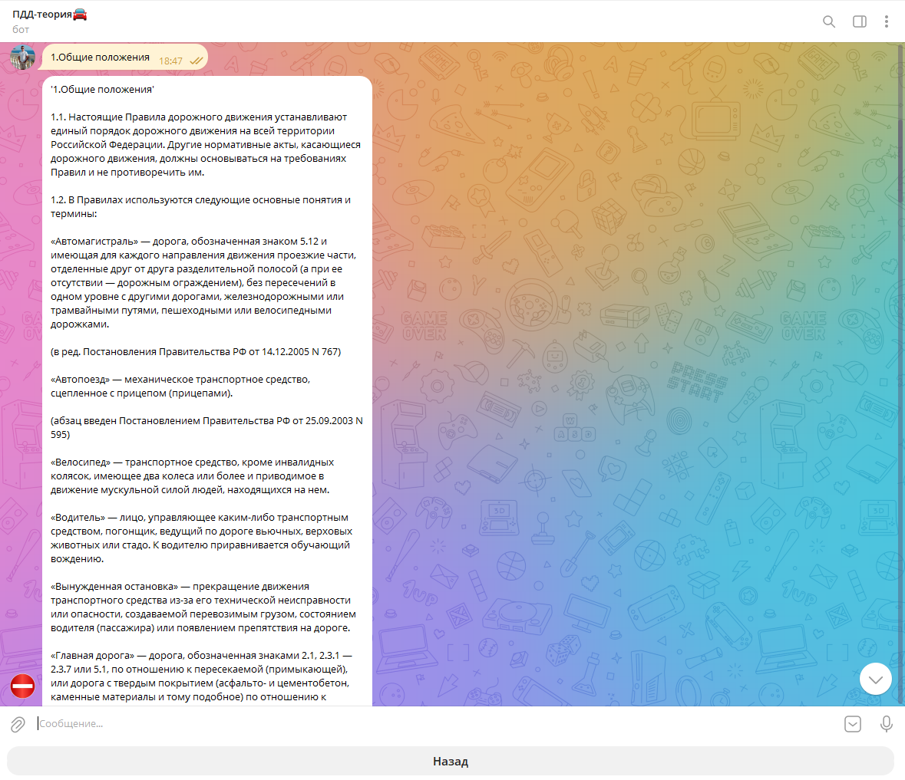

# PDDBot (Telegram Bot)

Telegram бот для изучения Правил Дорожного Движения с интерактивным меню и структурой тем.

## Быстрый старт 🚀

### Предварительные требования ⚙️
- ОС: Windows 10/11
- Платформа: .NET 6.0+
- IDE: Visual Studio 2022
- Telegram: аккаунт в Telegram
- Telegram Bot token

### Установка и запуск 🔧
1. Скачайте архив или клонируйте репозиторий
   ```bash
   git clone https://github.com/BanCoder/PDDBot.git
   cd PDDBot
   ```
2. Настройте конфигурацию 
   
   Создайте файл `appsettings.json` *(в папке `bin\Debug` рядом с .exe)* и вставьте слудующее:
   ```json
    {
	    "TgSettings": 
        {
		    "token": "your token"
	    }
    }
   ```

>***Важно!*** Для того, чтобы получить необходимый токен, найдите в Telegram специального бота (например: [BotFather](https://t.me/BotFather)), он создаст необходимый токен и сгенерирует `"Что может этот бот?`. Также, вам необходимо придумать название для вашего будущего бота (должен заканчиваться на `bot`, например: `my_random_bot`)

3. Запустите программу в Visual Studio 2022
   - Откройте решение `PDDBot.sln`
   - Нажмите на `F5` или на кнопку `Пуск`
   - Перейдите в папку `bin\Debug` и запустите .exe файл
   
### Как использовать бота? 🕹️
- Найдите бота в Telegram по имени или перейдите по ссылке(https://t.me/SPBPDDBot)
- Запустите бота командой /start
- Выбирайте тему из предложенного меню
- Изучайте подтемы - последовательный переход по разделам
- Возвращайтесь назад - кнопка "Назад" для навигации

### Важно ⚠️
- Бот работает, **пока запущено консольное приложение**. Не закрывайте его!
- После запуска в консоли появится надпись: "Бот запущен. Нажмите Enter для остановки..."

### Скриншоты 🖼️




### Особенности ✅
- Структурированное меню - иерархия тем и подтем
-  Интерактивные кнопки - удобная навигация
-  Полные материалы - подробное описание ПДД
-   Навигация назад - возможность вернуться к предыдущему меню
-   Бот будет работать только при запуске программы
### Архитектура 🛠️
#### Технологический стек 💻
- Консольное приложение (Майкрософт)
- Telegram.Bot - библиотека для работы с Telegram Bot API

#### Основные компоненты 📃
ButtonManager - обработчик кнопок 
FileManager - загрузка учебных материалов
SectionShower - управление показом тем
HandlerManager - обработчик сообщений 
URLManager - управление ссылками на материалы 
